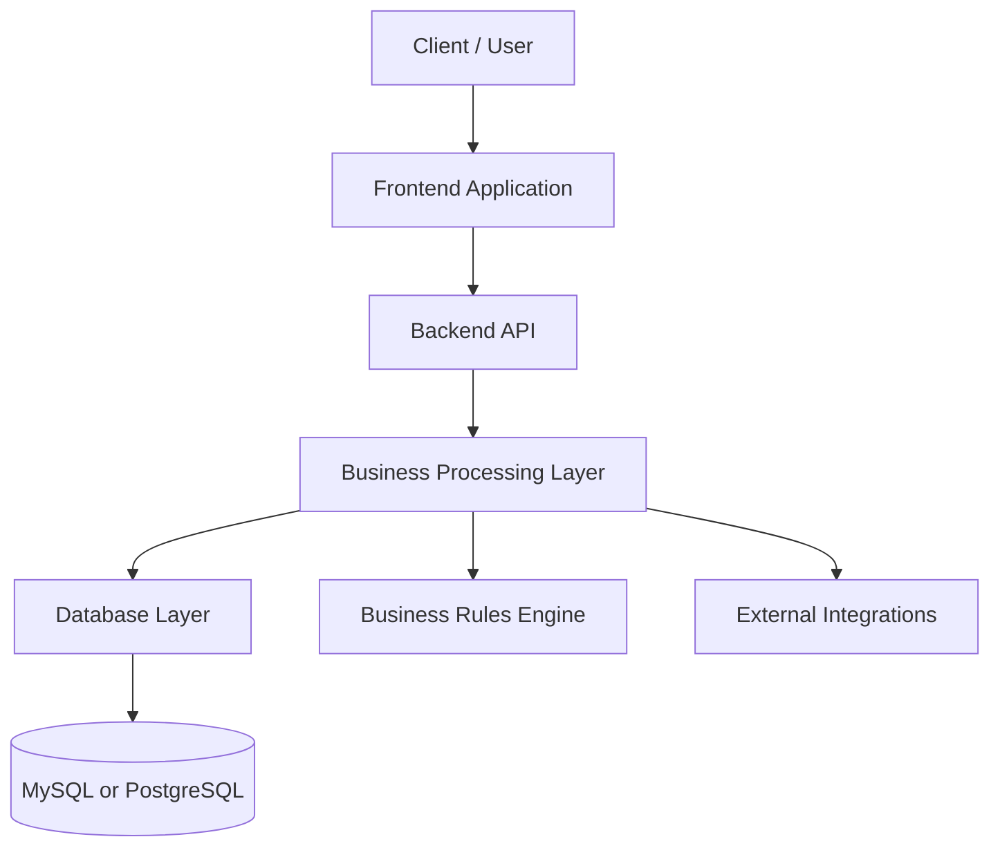

# Software Architecture Consultation Report  
### Database Selection: PostgreSQL vs MySQL

---

## 1. Introduction (Real-World Analogy)

Choosing a database is similar to deciding how a company should organize its operations.

Imagine a growing delivery business:

- In one model, **all decision-making happens in a central office (backend)**, while warehouses simply store packages. This is fast to start but becomes harder to manage as the company scales.
- In another model, **warehouses also enforce rules, validate shipments, and manage part of the workflow themselves**, reducing pressure on the central office and improving consistency.

This reflects the difference between MySQL and PostgreSQL:

- MySQL → storage-focused system (backend holds most intelligence)
- PostgreSQL → domain-aware system (intelligence shared between DB and backend)


## 2. Core Problem Definition

The real question is not:

> Which database is better?

But instead:

> How should intelligence and business logic be distributed in the system?


## 3. Architectural Models

### 3.1 Storage-Centric Model (MySQL-Oriented)

- Database is mainly for storage
- Backend handles all business logic
- Simple and fast to build

**Result:**
- Backend becomes complex over time


### 3.2 Domain-Centric Model (PostgreSQL-Oriented)

- Database participates in enforcing business rules
- Uses constraints, functions, triggers
- Reduces backend burden

**Result:**
- Stronger data integrity and cleaner architecture


## 4. Decision Comparison (Improved Visual Chart)

### 4.1 Feature Comparison Matrix

| Decision Factor            | MySQL (Storage-Centric) | PostgreSQL (Domain-Centric) | Impact on Decision |
|----------------------------|--------------------------|------------------------------|--------------------|
| Ease of Start              | ⭐⭐⭐⭐⭐ (Very Easy)        | ⭐⭐⭐⭐ (Easy)                  | Faster MVP → MySQL |
| System Scalability         | ⭐⭐⭐                      | ⭐⭐⭐⭐⭐ (Excellent)            | Growth → PostgreSQL |
| Data Integrity             | ⭐⭐⭐                      | ⭐⭐⭐⭐⭐ (Strong)              | Critical → PostgreSQL |
| Backend Complexity         | ⭐⭐ (High Over Time)      | ⭐⭐⭐⭐ (Lower)               | Cleaner architecture → PostgreSQL |
| Business Logic Location    | Backend only             | Shared (DB + Backend)        | Domain-driven → PostgreSQL |
| Maintenance Cost (Long-term)| ⭐⭐⭐                    | ⭐⭐⭐⭐⭐ (Lower)              | Long-term systems → PostgreSQL |


### 4.2 Quick Decision Guide (At a Glance)


IF project = simple CRUD OR MVP OR fast launch
    → Choose MySQL

IF project = complex logic OR scaling system OR enterprise architecture
    → Choose PostgreSQL
```


## 5. Key Architectural Insight

- MySQL → “Backend does all the thinking”
- PostgreSQL → “Database and backend share responsibilities”

This directly affects:
- System complexity
- Scalability
- Long-term maintenance

---

## 6. Recommendation

### Use MySQL if:
- Simple applications
- Rapid prototyping
- Minimal business logic

### Use PostgreSQL if:
- Complex systems
- Long-term scalability
- Strong consistency requirements
- Domain-driven design approach

---

## 7. Final Decision Statement

PostgreSQL is generally the stronger choice for modern scalable systems due to its ability to support richer domain modeling and reduce backend complexity.

However, the correct choice always depends on:
- Project complexity
- Team experience
- Growth expectations
- Business requirements

---

## 8. Closing Note

Database choice is not just technical—it defines system behavior:

- Where logic lives
- How scalable the system becomes
- How maintainable it is in the long run

---

## 9. System Flow Overview



---

## 10. Real-Life Interpretation

- Frontend = Customer interaction point
- Backend = Operations manager
- External services = Partners (payments, logistics, notifications)
- Database = Warehouse system

Difference:
- MySQL → warehouse only stores goods
- PostgreSQL → warehouse also validates and enforces rules
```
